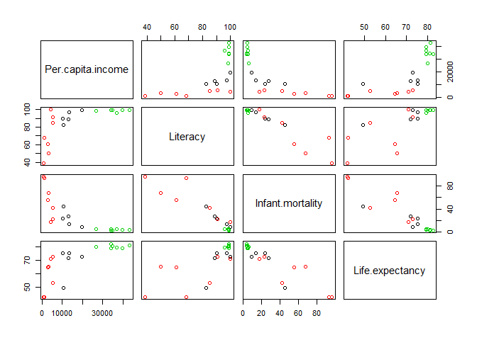

# K-Means Clustering Demo
J Welch  
November 2, 2016  

# K-Means Clustering

This is a simple educational exercise that introduces the use of K-Means Clustering with R Studio.  I have chosen to follow the exercise as outlined per the following page at [WikiBooks.org](https://en.wikibooks.org/wiki/Data_Mining_Algorithms_In_R/Clustering/K-Means).  This page explains this important technique and then provides a simple Case Study that makes use of some country data complete with data related to the 'Per capita income', 'Literacy', 'Infant mortality', and 'Life expectancy'.

I copied the given data off the web page and created a CSV file entitled 'data.txt' as used within the Case Study.  I am going to follow the given code and create the result myself in R Studio.


```r
# import data (assume that all data in "data.txt" is stored as comma separated values)
x <- read.csv("data.txt", header=TRUE, row.names=1)

# run K-Means
km <- kmeans(x, 3, 15)
 
# print components of km
print(km)
```

```
## K-means clustering with 3 clusters of sizes 5, 7, 7
## 
## Cluster means:
##   Per.capita.income Literacy Infant.mortality Life.expectancy
## 1         13370.400    91.58        23.560000        68.96000
## 2         35642.143    98.50         4.477143        80.42857
## 3          3267.286    70.50        56.251429        58.80000
## 
## Clustering vector:
##         Brazil        Germany     Mozambique      Australia          China 
##              1              2              3              2              3 
##      Argentina United Kingdom   South Africa         Zambia        Namibia 
##              1              2              1              3              3 
##        Georgia       Pakistan          India         Turkey         Sweden 
##              3              3              3              1              2 
##      Lithuania         Greece          Italy          Japan 
##              1              2              2              2 
## 
## Within cluster sum of squares by cluster:
## [1]  57626083 158883600  20109876
##  (between_SS / total_SS =  94.1 %)
## 
## Available components:
## 
## [1] "cluster"      "centers"      "totss"        "withinss"    
## [5] "tot.withinss" "betweenss"    "size"         "iter"        
## [9] "ifault"
```

```r
# plot clusters
plot(x, col = km$cluster)
# plot centers
points(km$centers, col = 1:2, pch = 8)
```

<!-- -->

